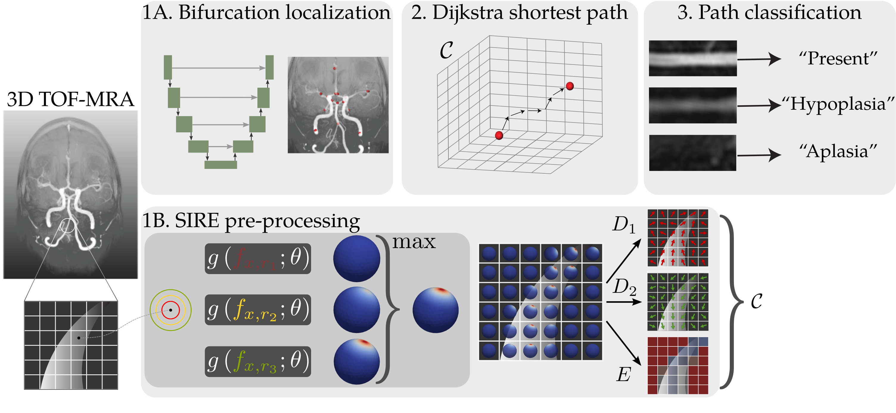

# Anatomically Robust Extraction of Personalized Circle of Willis Topology from 3D TOF-MRA Scans

This is the repository of our paper Anatomically Robust Extraction of Personalized Circle of Willis Topology from 3D TOF-MRA Scans.\
Our paper is currently under review for MIDL 2024, the code will be released publicly upon acceptance.

Link to the paper on [OpenReview](<https://openreview.net/forum?id=Qop6HhcS0g&referrer=%5BAuthor%20Console%5D(%2Fgroup%3Fid%3DMIDL.io%2F2024%2FConference%2FAuthors%23your-submissions>)

## Environment
The conda environment can be created through the `environment.yml` file:\
`conda env create -f environment.yml -n cow_extraction`\
In addition, we need the gauge-equivariant mesh convolution library (as SIRE depends on it):
```bash
git clone https://github.com/Qualcomm-AI-research/gauge-equivariant-mesh-cnn.git
cd gauge-equivariant-mesh-cnn
pip install .
```
If you get an error regarding OpenMesh, try
```bash
conda install -c conda-forge openmesh-python
```
then try to pip install again.

## Data
Data is stored in the `/data` directory, with the following structure:
```
/data
    /scans
        /<Patient ID>.nii.gz
    /bifurcations
        /<Patient ID>.npy
    /sire-weights
        /model-weights.pt
        /train.yml
```
SIRE model weights and the parameters in `/train.yml` can be downloaded from [here](https://surfdrive.surf.nl/files/index.php/s/wmQLFBQkFNVWAyQ).

## Usage
The code for automatic topology extraction is in `/scripts/extract_topology.py`. Patient ID and parameters are hardcoded in this script and can be changed there.
The figure below gives an overview of the method. `extract_topology.py` saves both the paths found by Dijkstra's algorithm (as a dictionary where the world-coordinates can be accessed through the key `'world'`). This script also saves the result of the SIRE preprocessing filter as a 9D vectorfield, with the following contents:
$[D_1(x), D_1(y), D_1(z), D_2(x), D_2(y), D_2(z), \text{entropy}, \text{max activation}, \text{max scale}]$.



## Results
Results are automatically saved in the `/results` folder after running the 